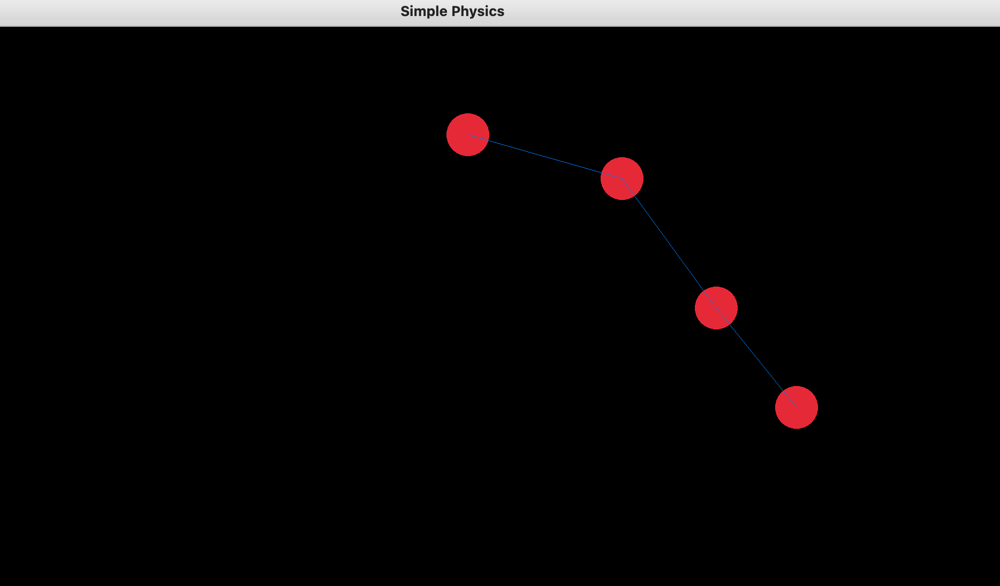

# SimplePhysics

A constraint based physics simulation based on the *Physically Based Modeling: Principles and Practice Constrained Dynamics* paper by Andrew Witkin [here](https://www.cs.cmu.edu/~baraff/sigcourse/notesf.pdf)

Features an editor where a custom structure can be designed and then simulated.

